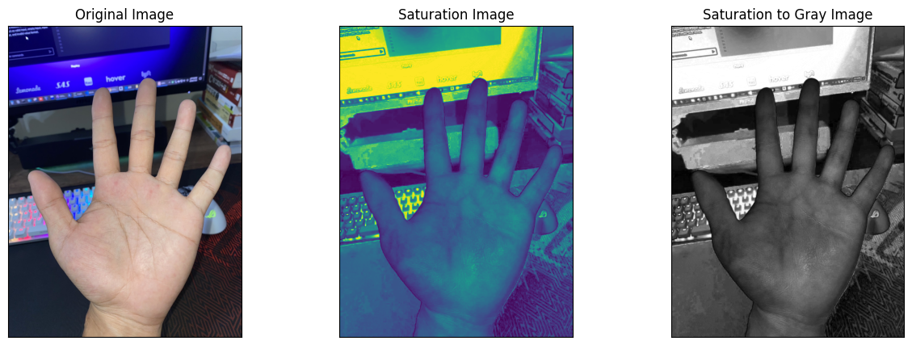

# Wrist-Vein-on-Saturation-Channel

## 簡介
程式練習...

傳統靜脈識別中，通常搭配波長 700 nm 到 1000 nm 之間的近紅外光設備來穿透皮膚，拍攝人體靜脈的特徵。這種方法需要額外的近紅外光設備。為了降低成本，希望僅使用 RGB 影像，將其轉換為 HSL 色彩空間，並提取其中的飽和度通道來增強靜脈特徵。

參考資料如下:

1. 演算法部分參考 IEEE TRANSACTIONS ON INDUSTRIAL INFORMATICS: [Recognizing Palm Vein in Smartphones Using RGB Images](https://ieeexplore.ieee.org/document/9648012)

---

## 提取演算法

---

## 實際測試結果

---

## 使用方法

替換為想測試的圖片後，直接執行 `saturation_channel.ipynb` 

---

## Requirements

python==3.9.2

opencv-python==4.5.3.56

numpy==1.26.4

matplotlib==3.8.0
